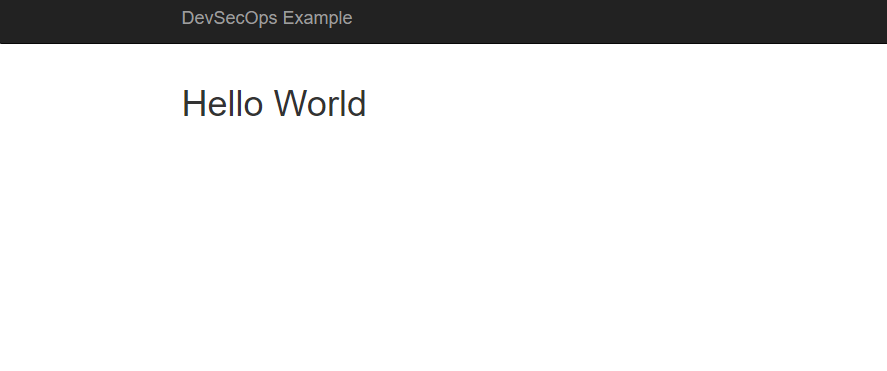
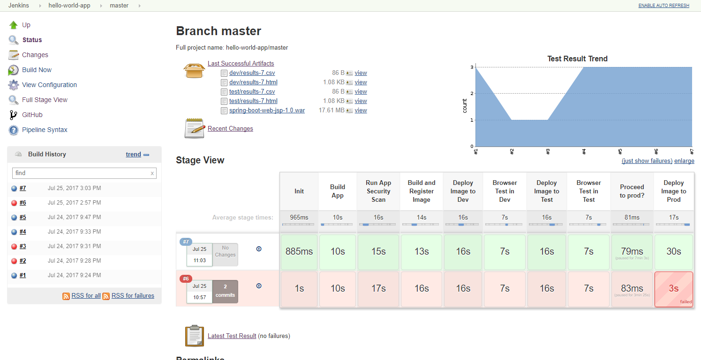
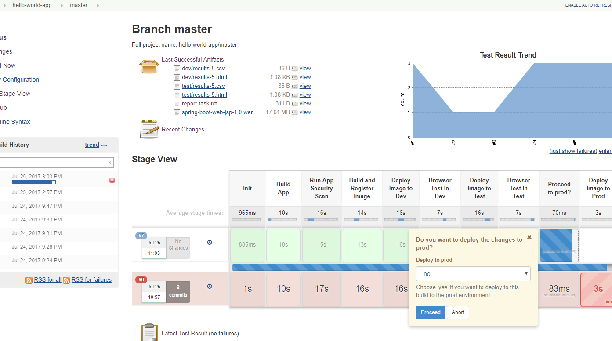
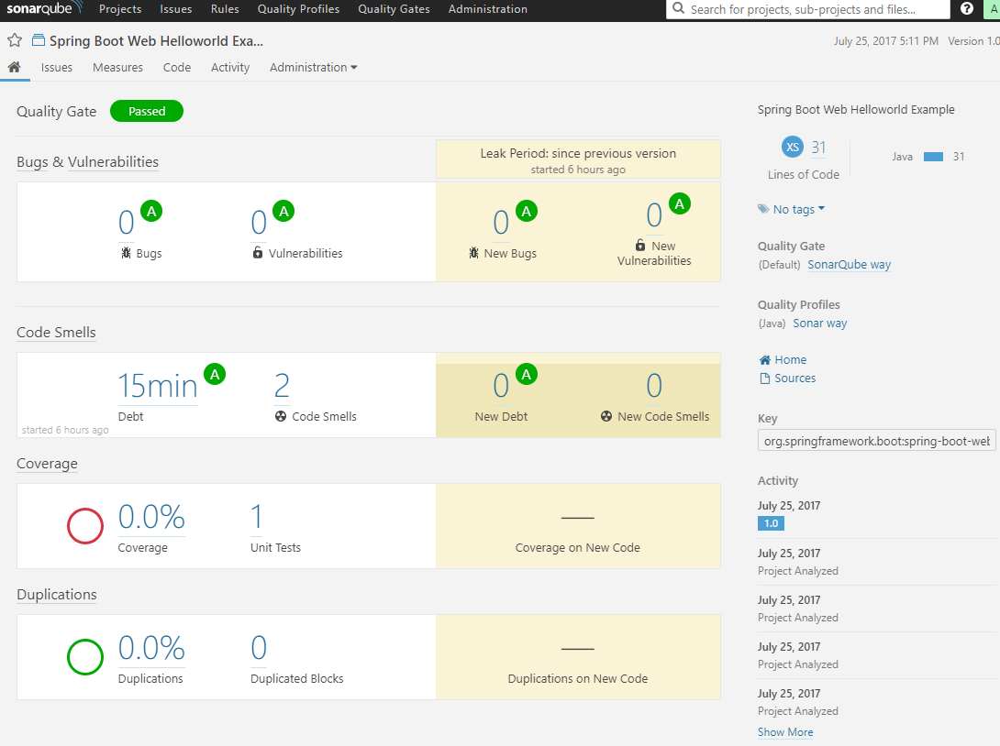
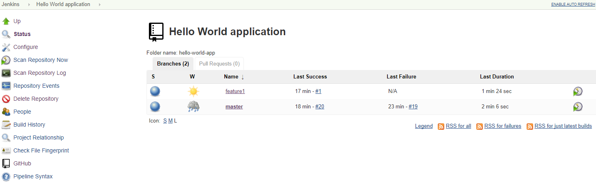

# DevSecOps CI/CD Pipeline Example

# Jenkins Multibranch Pipeline

This example uses a [Jenkins multi-branch pipelines].
The code for this pipeline can be found [here](./Jenkinsfile).

Jenkins multi-branch pipelines build all your branches in your repository under source code
control (e.g. github) automatically. Note that you can explicitly include/exclude branch using
regular expressions.
This allows for a development approach with short-lived feature and bugfix 
branches that can be build, deployed, and tested simultaneously.
This is important, because it  allows developers to update and test the pipeline as part of 
the change request (or bugfix) they are working on,
so the pipeline code always stays in sync with the the application code.
Furthermore, __"standard"__ development processes can now not only be applied to the
application code, but also to the pipeline code, specifically source code control, testing, 
and code review.

## Pipeline Steps

1. Build the Java [Spring Boot] [application](./webapp/src/main) using [Apache Maven]
   This includes running [unit tests](./webapp/src/test//java).
2. Performs a security scan on the Java code base using [SonarQube] via Maven
3. Build and register a version of the [Docker image](./Dockerfile)
4. Deploy the image to the `dev` environment
5. Run the automated browser tests against the application in the `dev` environment.
   The [browser tests](./webapp/src/test/python/helloworld) are written in
   [Python](./webapp/src/test/python) using the [Python Selenium Webdriver API binding].
6. Deploy the image to the `test` environment
7. Run the automated browser tests against the application in the `test` environment
8. Pause for confirmation that the new image can be deployed to the `prod` environment.
   Allow for some manual tests to be executed before 
   This step times out after some (configurable amount of) time.
9. Deploy the image to the `prod` (or live) environment

Web Application:
  

Pipeline executions:
   

Pause step (step 8):
   

SonarQube (security scan) output:
   

Note that in the above steps, steps 5 and up in the pipeline are __only__ 
executed against the `master` branch.
The pipeline code is configured to treat development (feature/bugfix) branches as
additional `dev` environments.
These temporary additional `dev` environments can quickly be created using the application's
[cloud-formation script](./cloud-formation/helloworld/app/main.yml) and
setting the `Environment` parameter to `dev-<branch-name>` and the `SecurityContext` parameter
to `dev`.
The new `dev-<branch-name>` environment now operates in the same security context as the `dev`
environment`.

Now when a new temporary development branch is created of the master branch,
the Jenkins pipeline will automatically discover the new branch and
execute the pipeline code from that specific branch allow a developer to build and test
the branch specific changes in isolation, including changes to the pipeline code.

Multiple branch executions (`feature1` and `master`) after creating the `feature1` branch:

Development branch (`feature`) execution details:

## Development Process

The following outlines how this development pipeline would be used in a (typical) development
process:
1.  A user story (or bug) ticket is assigned to a developer
2.  Create a temporary and short-lived development (feature/bugfix) branch environment
    using the Hello World application
    [cloud formation script](../cloud-formation/helloworld/app/main.yml).
    Run the script setting the `Environment` parameter to `dev-<name>` and the 
    the `SecurityContext` parameter to `dev`.
3.  A development branch is created in the repository using the format feature/<name> or 
    bug-fix/<name> from the `master` branch
4.  The developer implements and tests the changes, include new and/or updated automated tests.
5.  Changes are committed to the branch and tested.
    The developer references the ticket in the commit message to allow for integration
    with the ticketing system, e. GitHub-Jira Integration.
6.  Changes are pushed to the central git server.
7.  A git webhook triggers the Jenkins pipeline for the feature branch.
8.  If pipeline build fails, either fix infrastructure issue, or return to step 3
9.  Manually test the changes
10. Once satisfied acceptance criteria are met, create a Pull Request (PR) to the master branch 
    and assign a reviewer.
11. Reviewer verifies changes.
12. If not accepted, return to step 3
13. Reviewer accepts changes, the reviewer or developer merges the PR into `master` and 
    deletes the branch
14. Delete the temporary development branch environment.
15. A git webhook triggers the Jenkins pipeline for the master branch
16. Manual tests (if any are executed against the Test environment
17. If problems are detected, return to step 3
18. Accept changes and push to production

## Possible Extensions

1. Automate the creation and deletion of temporary development branch environment
1. Create separate test suites to allow for a smoke vs. a full suite of tests.
   Smoke tests would always be applied to each environment, including production.
   The full suite of tesst would only be executed against pre-production environments.
2. Application/browser tests are executed against all targetted brower/platform configurations
   using a hosted service, such as [Browserstack] or [Saucelabs].
3. Add performance testing in the pipeline, e.g. using [Taurus] and/or [Apache jMeter].
4. Penetration tests are executed as part of the pipeline,e.g. using OWAPS' [ZAProxy]
5. Integrate a notification mechanism with the pipeline, e.g. [Slack](./doc/slack-integration.md)
6. If an Restful API component is added, use [Newman] to run API tests using [Postman] 
   test collections via [Newman Docker image].

## How to Install
[Installation instructions](./doc/Install.md) can be found [here]((./doc/Install.md)).

[Jenkins multi-branch pipelines]: https://jenkins.io/blog/2015/12/03/pipeline-as-code-with-multibranch-workflows-in-jenkins/
[ZAProxy]: https://github.com/zaproxy/zaproxy
[Taurus]: https://gettaurus.org/
[Apache jMeter]: http://jmeter.apache.org/
[Browserstack]: https://www.browserstack.com/
[Postman]: https://www.getpostman.com/docs/postman/scripts/test_scripts
[Newman]: https://github.com/postmanlabs/newman
[Newman Docker image]: https://hub.docker.com/r/postman/newman_ubuntu1404/
[Spring Boot]: https://projects.spring.io/spring-boot/
[Python Selenium Webdriver API binding]: http://selenium-python.readthedocs.io/api.html
[Apache Maven]: https://maven.apache.org/
[SonarQube]: https://www.sonarqube.org/
[GitHub-Jira Integration]: https://confluence.atlassian.com/adminjiracloud/connect-jira-cloud-to-github-814188429.html
[Saucelabs]: https://saucelabs.com/