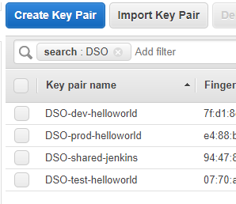
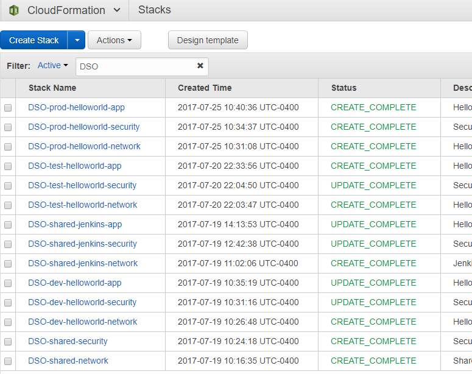
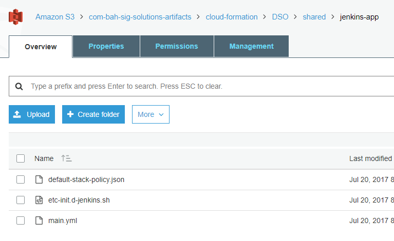

# Installation

This CI/CD pipeline example can be installed by running various cloud-formation scripts listed 
below.
Note that rather than using a single script this example uses multiple scripts to establish a
separation of concerns (networking, security, application) to reflect a separation of these 
concerns that will be in effect in most organizations. 
Here the separation is used to demonstrate a scalable solution to this separation of concerns.
In a 'real world' secnario these cloud-formation scripts would be separated into separate
`git` repositories. However, here they are combined for convenience.


## Overall Approach

To provide scalability and consistency, all cloud-formation scripts have a set of common 
parameters, such as: `System` name, `Environment` name, `AWS Region`, 
and (optional) S3 `Provisioning Bucket`.
name. Furthermore they may have specific values, such as `CIDRBlock`, `Instance AMI` and 
`Instance Size`.
Those scripts run additional EC2 initialization/provisioning use an S3 bucket to 
share information, e.g. files to be installed on an EC2 instance, 

The various cloud formation stacks follow a naming conventions that is adhered to when creating objects 
in the S3 bucket. The structure is used to ensure access rights are set approrpiately for 
the AWS IAM Policies that are generated by the [security](../cloud-formation/security) scripts.

The expected 'directory' structure is as follows:

```
      <bucket>/cloud-formation/<system>/<environment>/<stack>/<stack-resources>
```

One of the advantage of taking this structured approach (common parameters, S3 structuring) is
that not only the application pipeline can be fully automated, the infractructure can easily 
be automated using a development pipeline as well.


## Prerequisites:

1. You need to have an AWS account with  rights to create/delete/modify AWS S3, VPC, IAM,
   EC2, and ECS resources.
2. Create (or import) an [AWS EC2 keypair] with the name `<system>-shared-jenkins` and 
   save the private key.
   where Jenkins is the value of the parameter given to the cloud formation scripts.
3. Create (or import) an [AWS EC2 keypair] with the name `<system>-dev-helloworld` and 
   save the private key.
4. Create (or import) an [AWS EC2 keypair] with the name `<system>-test-helloworld` and 
   save the private key.
5. Create (or import) an [AWS EC2 keypair] with the name `<system>-prod-helloworld` and 
   save the private key.
6. Create an [AWS S3 bucket] for AWS resource provisioning.

Note that:
- The name is relevant, because the cloud-formation scripts, rather than having the named
  passed to it, internally builds the key pair name from the `System` and `Environment`
  parameters. The advantage is that this enforces a consistent naming sructure and 
  eliminates the need for passing the key pair names.
- The default values for <system> is `DSO` (default for cloud-formation parameters),
  so when you plan to use the default create a key pairs using DSO for <system>, 
  e.g. `DSO-shared-jenkins`.

  


## Install common AWS Resources:
To install the common AWS VPC and IAM resources run the following cloud-formation scripts:

1. Run the cloud-formation script in [network/shared](../cloud-formation/network/shared)
   using the listed [policy](../cloud-formation/network/shared/default-stack-policy.json)
2. Run the cloud-formation script in [security/shared](../cloud-formation/security/shared)
   using the listed [policy](../cloud-formation/security/shared/default-stack-policy.json)


## Install the helloworld application on EC2 instances for a dev, test, and prod environment:

Repeat these steps passing `dev`, `test`, and `prod` as the parameter values for the 
`Environment` parameter in the various stacks:

1. Run the cloud-formation stack in [network/hello-world](../cloud-formation/network/helloworld)
   using the listed [policy](../cloud-formation/network/helloworld/default-stack-policy.json)
   Pass a value for parameter:
   - `Environment`. Either `dev`, `test`, or `prod`
   - `ApplicationCIDRBlock`. This CIDR Block must fall within the VPC `CIDRBlock`,
     e.g. `172.27.x.0/24` (where x is 10 for `dev`, 20 for `test` and 30 for `prod`).
2. Run the cloud-formation stack in [security/hello-world](../cloud-formation/security/helloworld/main.yml)
   using the listed [policy](../cloud-formation/security/helloworld/default-stack-policy.json)
   Pass a value for parameter:
   - `Environment`. Either `dev`, `test`, or `prod`
   - `VPCCIDRBlock` that matches the earlier value (see common AWS Resources).
   - `PrivilegedCIDRx` (for x=1..5) to enable access to resources on the private 
      Jenkins subnet. At least one privileged address is needed to be able to obtain the 
      initial Jenkins administrator password.
3. Run the cloud-formation stack in [helloworld/app](../cloud-formation/helloworld/app/main.yml)
   using the listed [policy](../cloud-formation/helloworld/app/default-stack-policy.json)
   Pass a value for parameter:
   - `Environment`. Either `dev`, `test`, or `prod`.
   - `SecurityContext`. Match the value of `Environment`.
   
   To verify that application instance is install, browse to
      `http://<PublicIP output value of Stack>`.
   Initially the provisioning scripts sets up a web application using the 
   [kitematic/hello-world-nginx](https://hub.docker.com/r/kitematic/hello-world-nginx/)
   docker image.
   Once the [pipeline](../Jenkinsfile) is executed this application will be automatically
   replaced with the actual [hello world](../webapp/sc/main) application using the
   [Docker image[../Dockerfile)]

Once completed you should something similar to the following in your AWS Cloud Formation console:



## Install Jenkins on EC2 instance:
To install the the AWS resources for the Jenkins instance run the following cloud-formation
scripts and subsequently configure Jenkins:

1. Run the cloud-formation script in [network/jenkins](../cloud-formation/network/jenkins)
   using the listed [policy](../cloud-formation/network/jenkins/default-stack-policy.json)
2. Run the cloud-formation script in [security/jenkins](../cloud-formation/security/jenkins)
   using the listed [policy](../cloud-formation/security/jenkins/default-stack-policy.json)
   Pass a value for parameters:
   - `PrivilegedCIDRx` (for x=1..5) to enable access to resources on the private Jenkins subnet.
      At least one privileged address is needed to be able to obtain the initial Jenkins
      administrator password.
3. Run the cloud-formation script in [jenkins/app](../cloud-formation/jenkins/app)
   using the listed [policy](../cloud-formation/jenkins/app/default-stack-policy.json)
   Jenkins is configured to 
   [run inside Docker](../cloud-formation/jenkins/app/etc-init.d-jenkins.sh).
   Furthermore, in this example setup the Jenkins instance also runs
   [SonarQube]() inside.
   [Docker](https://hub.docker.com/_/sonarqube/)
   Pass a value to parameters:
   - `ProvisioningBucket` The name ofn AWS S3 Bucket you created in the prerequisites.
     Create the forementioned 'folder' structure in ths S3 bucket using
     `<your bucket>/cloud-formation/<system>/shared/jenkins-app` and
     upload file `etc-init-d-jenkins.sh` into this 'folder'
     
     


4. Configure Jenkins:

   a. Get the initial administrator password:
      - Login to the Jenkins EC2 instance with the jenkins key 
        `ssh -i DSO-shared-jenkins <jenkins-public-ip>`
      - Get the key from `/var/jenkins_home/secrets/initialAdminPassword`

   b. Browse to Jenkins at `http://<jenkins-public-ip>` and use the initial password to login
   
   c. Choose to install the default plugins
   
   d. Next install the SSH and SSH Agent plugins under `Manage Jenkins > Manage Plugins`
   
   e. Create the following credentials under `Credentials > global`
      - (Optional, if repo is private) A valid Git credential (ID: `*any*`)
      - An SSH Username with private key for the hello-world dev app instance 
        (ID: `DSO-dev-helloworld`, Username: `ec2-user`) using the private key from 
        the matching EC2 Keypair
      - An SSH Username with private key for the hello-world test app instance 
        (ID: `DSO-test-helloworld`, Username: `ec2-user`) using the private key from 
        the matching EC2 Keypair
      - An SSH Username with private key for the hello-world prod app instance 
        (ID: `DSO-prod-helloworld`, Username: `ec2-user`) using the private key from 
        the matching EC2 Keypair

    f. Add users as appropriate under `Manage Jenkins > Manage Users`

5. Setup the multi-pipeline job for the Hello World Application 
 
    a. Create the job using `New Item` with item name `hello-world-app` and 
       the `Multibranch pipeline` option
    b. Specify a `Hello World application` as the Display Name (Optional)
    c. Add your GitHub repo as a source using the `Add Source` button with the GitHub option
       - Select the github Credentials ID you created earlier (if repo is private)
       - Enter your organization's name, e.g. `boozallen`
       - Select the repository, e.g. `devsecops-example-helloworld`
       - Select the `Save` button
    
    Your Jenkins pipeline should now start to discover the branches in the designated
    repository, and once it discovers the Jenkinsfile, start to build all branches found.
    If you have multiple branches and want to limit building to the `master` branch you can
    add a `Filter by Name` Behavior before selecting `Save`


[AWS EC2 keypair]: http://docs.aws.amazon.com/AWSEC2/latest/UserGuide/ec2-key-pairs.html
[AWS S3 bucket]: http://docs.aws.amazon.com/AmazonS3/latest/dev/UsingBucket.html
[SonarQube]: https://docs.sonarqube.org/display/SONAR/Documentation
[SonarQube Docker image]: https://hub.docker.com/_/sonarqube/
